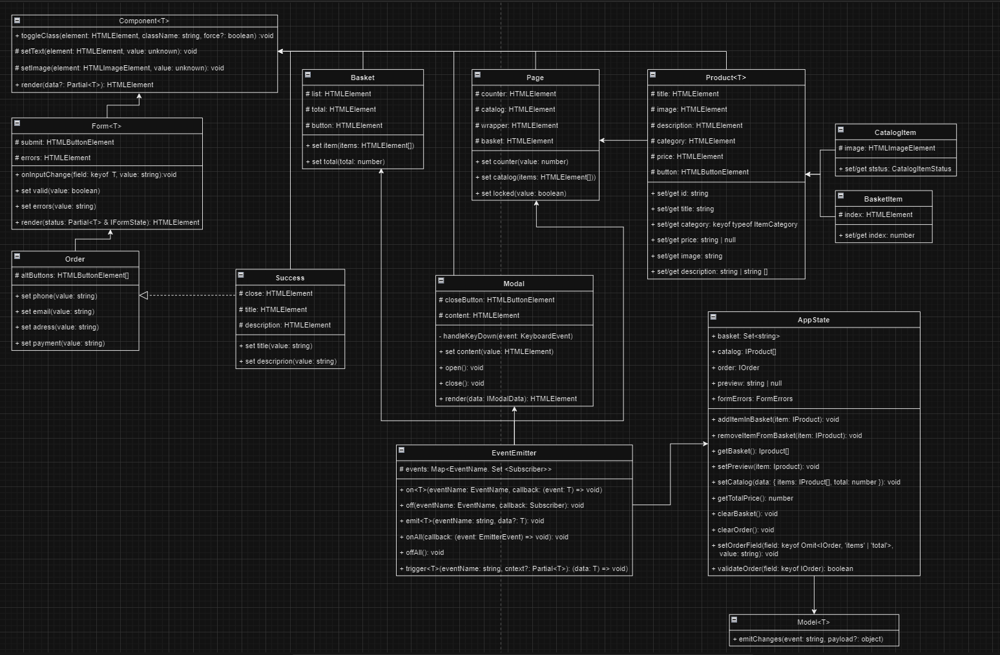

# Проектная работа "Веб-ларек"

Стек: HTML, SCSS, TS, Webpack

Структура проекта:
- src/ — исходные файлы проекта
- src/components/ — папка с JS компонентами
- src/components/base/ — папка с базовым кодом

Важные файлы:
- src/pages/index.html — HTML-файл главной страницы
- src/types/index.ts — файл с типами
- src/index.ts — точка входа приложения
- src/styles/styles.scss — корневой файл стилей
- src/utils/constants.ts — файл с константами
- src/utils/utils.ts — файл с утилитами

## Установка и запуск
Для установки и запуска проекта необходимо выполнить команды

```
npm install
npm run start
```

или

```
yarn
yarn start
```
## Сборка

```
npm run build
```

или

```
yarn build
```
## Архитектура


## Базовый код
### 1. Класс `Component<T>`

`Component` абстрактный класс, предназначенный для создания и управления компонентами веб-интерфейса. Класс обеспечивает базовый функционал для работы с DOM-элементами и предоставляет методы для их управления.

Класс является дженериком и в переменной Т принимает тип данных компонентов.

#### Конструктор

```typescript
protected constructor(protected readonly container: HTMLElement)
```
Конструктор принимает такие аргументы:

`container: HTMLElement` — контейнер, в котором будет размещен компонент. Доступен для наследуемых классов только для чтения.

Класс имеет такие методы:

- `toggleClass` , `setText` , и `setImage` — для управления DOM элементами: переключение CSS класса, установка текстового содержимого и задание источника с альтернативным текстом для изображений соответственно.

- `render` — основной метод для рендера или обновления состояния компонента, принимает данные и возвращает элемент контейнера.

### 2. Класс `EventEmitter`

Реализует паттерн «Наблюдатель» и позволяет подписываться на события и уведомлять подписчиков
о наступлении события.

Класс имеет методы `on` ,  `off` ,  `emit`  — для подписки на событие, отписки от события и уведомления
подписчиков о наступлении события соответственно.

Дополнительно реализованы методы  `onAll` и  `offAll`  — для подписки на все события и сброса всех
подписчиков.

Интересным дополнением является метод  `trigger` , генерирующий заданное событие с заданными
аргументами. Это позволяет передавать его в качестве обработчика события в другие классы. Эти
классы будут генерировать события, не будучи при этом напрямую зависимыми от
класса  `EventEmitter` .

### 3. Класс `Model<T>`

 Представляет собой базовую абстрактную модель, предназначенную для отделения моделей с бизнес-логикой от простых объектов с данными. Он интегрируется с системой событий и предоставляет механизм оповещения о изменениях в данных модели.

#### Конструктор

```typescript
constructor(data: Partial<T>, protected events: IEvents)
```

Конструктор принимает такие аргументы:

1. `data: Partial<T>` — начальные данные для модели. Эти данные будут назначены экземпляру модели.

2. `events: IEvents` — экземпляр объекта, реализующего интерфейс IEvents, используется для уведомления о событиях, связанных с моделью.

Класс имеет такие методы:

- `emitChanges` — этот метод используется для уведомления подписчиков о изменениях в модели, позволяя эмитировать событие с указанным названием и необязательными данными (`payload`).

## Компоненты модели данных (бизнес-логика)
### Класс `AppState`

`AppState` используется для централизованного управления состоянием приложения, связанного с обработкой заказов, управлением корзиной покупок и каталогом товаров. Этот класс позволяет эффективно управлять данными пользователя, поддерживать согласованность данных между различными компонентами приложения и облегчать разработку и тестирование.

Класс имеет такие методы:

1. `addItemInBasket` : Добавляет продукт в корзину по его идентификатору, если он уже не добавлен.

2. `removeItemFromBasket` : Удаляет продукт из корзины по его идентификатору.

3. `getBasket` : Возвращает массив товаров, которые находятся в корзине.

4. `setPreview` : Устанавливает идентификатор продукта для предварительного просмотра.

5. `setCatalog` : Устанавливает каталог товаров и общее количество доступных товаров.

6. `getTotalPrice` : Рассчитывает и возвращает общую стоимость товаров в корзине.

7. `clearBasket` : Очищает все товары из корзины.

8. `clearOrder` : Сбрасывает информацию о текущем заказе.

9. `setOrderField` : Устанавливает значение определенного поля в объекте заказа.

10. `validateOrder` : Проверяет, заполнены ли обязательные поля в заказе, и устанавливает соответствующие ошибки.

### Класс `Order`

`Order` представляет собой конкретный класс для управления формой заказа. Он расширяет функциональность базовой формы, интегрируя элементы управления интерфейсом с бизнес-логикой обработки заказов. Этот класс взаимодействует с элементами формы на странице, обеспечивая валидацию данных и отправку информации о заказе.

#### Конструктор
```typescript
constructor(container: HTMLFormElement, events: IEvents)
```

Конструктор принимает слудующие аргументы:

- `container: HTMLFormElement`  — DOM-элемент формы, который предоставляет контекст для управления элементами формы и взаимодействия с пользователем.

- `events: IEvents` — экземпляр объекта, реализующего интерфейс IEvents. Используется для эмитирования событий, связанных с действиями в форме, такими как изменение выбранного способа оплаты.

Класс имеет такие методы:

`set phone` — устанавливает номер телефона в соответствующее поле формы.

`set email` — устанавливает адрес электронной почты в соответствующее поле формы.

`set address` — устанавливает адрес доставки в соответствующее поле формы.

`set payment` — устанавливает способ оплаты и эмитирует событие изменения способа оплаты.

### Класс `LarekApi`

`LarekApi` используется для абстрагирования доступа к внешнему API от остальной части приложения. Он предоставляет методы для выполнения HTTP-запросов к серверу, управления продуктами и заказами, что позволяет разработчикам фокусироваться на бизнес-логике, не беспокоясь о низкоуровневых деталях коммуникации с сервером.

#### Конструктор
```typescript
constructor(baseUrl: string, options?: RequestInit)
```

Конструктор принимает следующие аргументы:

- `baseUrl` — базовый URL API, который будет использоваться для всех запросов к серверу.

- `options(опционально)` — глобальные настройки запроса, которые будут применяться ко всем HTTP-запросам, исходящим от этого экземпляра API, включая заголовки, токены авторизации, и т.д.

Класс имеет такие методы:

1. `getProducts` — Получает список всех доступных продуктов с сервера.
2. `getProduct` — Получает детальную информацию о продукте по его идентификатору.
3. `createOrder` — Отправляет информацию о заказе на сервер и возвращает результат выполнения операции.

## Компоненты представления

### Класс `Basket`

`Basket` представляет собой компонент в архитектуре приложения, задачей которого является управление отображением корзины покупок. Этот класс наследуется от абстрактного базового класса Component, позволяя таким образом управлять элементами корзины и взаимодействовать с пользовательскими событиями.

#### Конструктор
```typescript
constructor(container: HTMLElement, protected events: IEvents)
```

Конструктор принимает следующие аргументы:

- `container: HTMLElement` — DOM-элемент, который служит контейнером для корзины, включая список товаров, общую стоимость и кнопку заказа.
- `events: IEvents` — экземпляр объекта, реализующего интерфейс IEvents. Используется для уведомления о событиях, таких как открытие формы заказа.

Класс имеет такие методы:

1. `set items` — Устанавливает элементы товаров в корзине.
2. `set total` — Устанавливает общую стоимость товаров в корзине.

Класс `Basket` используется для динамического управления содержимым корзины в пользовательском интерфейсе. Он позволяет добавлять или удалять товары, обновлять их количество, а также управлять процессом оформления заказа через интерфейс

### Класс `Form`

`Form` представляет собой обобщенный компонент для управления формами в приложении. Он наследует функциональность от базового класса Component и расширяет её, включая в себя логику обработки ввода пользователя и отправки формы.

#### Конструктор
```typescript
constructor(protected container: HTMLFormElement, protected events: IEvents)
```

Конструктор принимает следующие аргументы:

- `container: HTMLFormElement` — DOM-элемент формы, который служит контейнером для управления элементами формы.
- `events: IEvents` — экземпляр объекта, реализующего интерфейс IEvents, используется для генерации событий, связанных с действиями в форме.

Класс имеет такие методы:

1. `onInputChange` — Метод, вызываемый при изменении значений полей ввода.
2. `set valid` — Устанавливает свойство доступности кнопки отправки на основе валидности данных формы.
3. `set errors` — Устанавливает текст ошибки в элемент `_errors`
4. `render` — Обновляет состояние компонента и возвращает элемент контейнера.

Этот класс используется для создания и управления формами в приложении, обеспечивая стандартизированное управление вводом данных, валидацией и отправкой форм. Он также обрабатывает отображение ошибок и управляет доступностью кнопки отправки в зависимости от валидности формы.

### Класс `Modal`

Класс `Modal` является компонентом представления в архитектуре приложения, предназначенным для управления модальными окнами. Он обеспечивает функциональность открытия, отображения содержимого и закрытия модального окна, взаимодействуя с пользовательским интерфейсом через DOM.

#### Конструктор
```typescript
constructor(container: HTMLElement, protected events: IEvents)
```

Конструктор принимает следующие аргументы:

- `container: HTMLElement` — DOM-элемент, который используется в качестве контейнера для модального окна.

- `events: IEvents` — экземпляр объекта, реализующего интерфейс IEvents. Используется для генерации событий, связанных с действиями модального окна (открытие, закрытие).

Класс имеет такие методы:

1. `set content` — Устанавливает содержимое модального окна.
2. `open` — Открывает модальное окно, добавляя класс активности к container и эмитируя событие modal:open.
3. `close` — Закрывает модальное окно, удаляя класс активности из container, очищает содержимое и эмитирует событие modal:close.
4. `render` — Обновляет и отображает модальное окно с новым содержимым.

Этот класс может быть использован для управления модальными окнами в веб-приложении, позволяя динамически менять содержимое и управлять видимостью окна. Он поддерживает модульность и переиспользуемость в коде за счет управления всеми аспектами модального окна через единый интерфейс.

### Класс `Page`

Класс `Page` выступает в роли компонента представления в архитектуре веб-приложения, управляя основными элементами пользовательского интерфейса на веб-странице. Он наследуется от базового класса Component и предоставляет методы для управления контентом страницы, включая отображение количества товаров в корзине, управление каталогом товаров и блокировку интерфейса во время важных операций.

#### Конструктор
```typescript
constructor(container: HTMLElement, protected events: IEvents)
```

Конструктор принимает следующие параметры:

- `container: HTMLElement` — DOM-элемент, который служит контейнером для всей страницы.
- `events: IEvents` — интерфейс для обработки событий, который позволяет компоненту взаимодействовать с другими частями приложения через систему событий.

Класс имеет такие методы:

1. `set counter` — Устанавливает количество товаров в корзине.
2. `set catalog` — Обновляет каталог товаров на странице.
3. `set locked` — Блокирует или разблокирует основной интерфейс пользователя.

Этот класс используется для управления основными элементами интерфейса на веб-странице, обеспечивая динамическое взаимодействие с пользователем через обновление содержимого и управление доступностью интерфейса.

### Класс `Success`

Класс `Success` является компонентом представления для отображения сообщений об успешном выполнении операций, например, после успешного оформления заказа. Он расширяет функциональность базового класса Component, предоставляя специализированные методы для управления заголовками и описанием в контексте успеха операции.

#### Конструктор
```typescript
constructor(container: HTMLElement, actions: ISuccessActions)
```

Конструктор принимает следующие параметры:

- `container: HTMLElement` — DOM-элемент, который служит контейнером для элементов уведомления об успехе.
- `actions: ISuccessActions` — объект с методами для обработки событий, например, при клике на кнопку закрытия сообщения.

1. `set title(value: string)` — Устанавливает текст заголовка уведомления.

value: string — текст заголовка.
2. `set description(value: string)` — Устанавливает текст описания уведомления.

value: string — текст описания.

Этот класс предназначен для использования в случаях, когда необходимо информировать пользователя об успешном выполнении действия, например, после оформления заказа или успешной регистрации. Взаимодействие с пользователем происходит через кнопку закрытия, что позволяет ему закрыть уведомление.

### Классы `Product`, `CatalogItem` и `BasketItem`

#### Конструкторы
```typescript
constructor(protected blockName: string, container: HTMLElement, actions?: IProductActions)
```

- `blockName` — Имя блока для CSS-классов.
- `container` — Элемент контейнера продукта.
- `actions` — Действия, связанные с продуктом (например, клик)

`CatalogItem` и `BasketItem`

```typescript
constructor(container: HTMLElement, actions?: IProductActions)
```

Передают параметры в базовый класс `Product`.

Методы:

`title` , `category` , `price` , `image` , `description` — Геттеры и сеттеры для свойств продукта.
`id` — Уникальный идентификатор продукта.
`setText` , `setImage` — Вспомогательные методы для установки текста и изображений.

`CatalogItem` 

`status` — Отображает доступность продукта в каталоге.

`BasketItem`

`index` — Позиция продукта в корзине.

## Ключевые типы данных
```typescript
// структура данных продукта в приложении
interface IProduct {
  id: string;            // Уникальный идентификатор продукта
  title: string;         // Название продукта
  price: number;         // Цена продукта
  description: string;   // Описание продукта
  image: string;         // URL изображения продукта
  category: string;      // Категория продуктаstatus: boolean;       // Доступность продукта для покупки
}

// Структура заказа, сделанного пользователем
interface IOrder {
  payment: string | null; // Способ оплаты
  email: string;          // Email пользователя
  phone: string;          // Телефонный номер пользователя
  address: string;        // Адрес доставки
  total: number;          // Общая сумма заказа
  items: string[];        // Список ID товаров в заказе
}

//все события
enum Events {
  ITEMS_CHANGED = 'items:changed', // Изменение списка товаров
  ADD_PRODUCT = 'cart:add-product', // Добавление товара в корзину
  REMOVE_PRODUCT = 'cart:remove-product', // Удаление товара из корзины
  CREATE_ORDER = 'cart:create-order', // Создание заказа из корзины
  BASKET_OPEN = 'cart:open', // Открытие корзины пользователя
  OPEN_PREVIEW = 'product:open-preview', // Открытие детального просмотра товара
  CHANGED_PREVIEW = 'product:changed-preview', // Обновление детального просмотра товара
  FORM_ERRORS_CHANGE = 'form:errors-changed', // Изменение ошибок в формах
  ORDER_OPEN = 'order:open', // Открытие формы заказа
  ORDER_CLEAR = 'order:clear', // Очистка данных заказа
  SET_PAYMENT_METHOD = 'order:set-payment-method', // Установка метода оплаты
  MODAL_OPEN = 'modal:open', // Открытие модального окна
  MODAL_CLOSE = 'modal:close' // Закрытие модального окна
}
```

